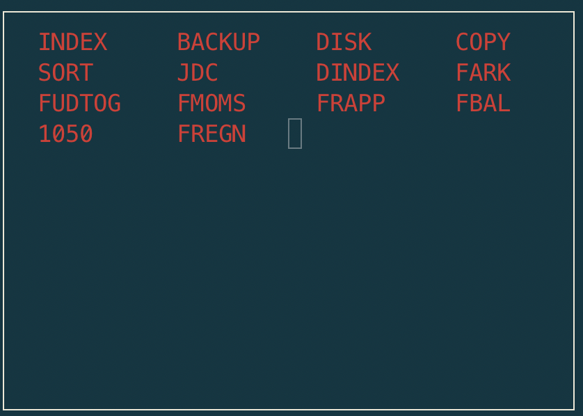

q1 floppy
^^^^^^^^^

Digitised by datamuseum.dk.

  Contents of **q1 floppy** as presented by DINDEX

The disk contains programs for accounting: FARK, FUDTOG, FMOMS, FRAPP, FBAL,
FREGN, including a chart of accounts 1050.

.. list-table:: Files
   :header-rows: 1

   * - Filename
     - Type
     - Date
     - Function
   * - INDEX
     - directory
     -
     - Housekeeping
   * - BACKUP
     - application
     - V05.12.82
     - Floppy disk backup
   * - DISK (MDISK)
     - application
     - 790827 (v2.8)
     - Disk formatting and allocation
   * - COPY
     - application
     - 821008 (v4.9)
     - Filecopy
   * - COPY
     - application
     - 821008 (v4.9)
     - Filecopy
   * - SORT
     - application
     -
     - (might be corrupted)
   * - JDC
     - application
     - V01.11.82
     - unknown (missing a program disk)

**DINDEX** can provide more details per file, but for a detailed oveview we
can use the command

.. code-block:: text

    > cd disks/datamuseum
    > python3 image.py

    Track information for track 0

    INDEX   : recno 0, nrecs   14, record size  40, recs/trk:  88, disk 0, first track  0, last track  0
    BACKUP  : recno 0, nrecs   14, record size 255, recs/trk:  19, disk 0, first track  1, last track  1
    DISK    : recno 0, nrecs   36, record size 255, recs/trk:  19, disk 0, first track  2, last track  3
    COPY    : recno 0, nrecs   18, record size 255, recs/trk:  19, disk 0, first track  4, last track  4
    SORT    : recno 0, nrecs    7, record size 255, recs/trk:  19, disk 0, first track  5, last track  5
    JDC     : recno 0, nrecs   25, record size 255, recs/trk:  19, disk 0, first track  6, last track  7
    DINDEX  : recno 0, nrecs   23, record size 255, recs/trk:  19, disk 0, first track  8, last track  9
    FARK    : recno 0, nrecs   43, record size 255, recs/trk:  19, disk 0, first track 10, last track 12
    FUDTOG  : recno 0, nrecs   64, record size 255, recs/trk:  19, disk 0, first track 13, last track 16
    FMOMS   : recno 0, nrecs   74, record size 255, recs/trk:  19, disk 0, first track 17, last track 20
    FRAPP   : recno 0, nrecs   59, record size 255, recs/trk:  19, disk 0, first track 21, last track 24
    FBAL    : recno 0, nrecs   79, record size 255, recs/trk:  19, disk 0, first track 25, last track 29
    1050    : recno 0, nrecs 5412, record size  20, recs/trk: 126, disk 0, first track 30, last track 72
    FREGN   : recno 0, nrecs   19, record size 255, recs/trk:  19, disk 0, first track 73, last track 73
