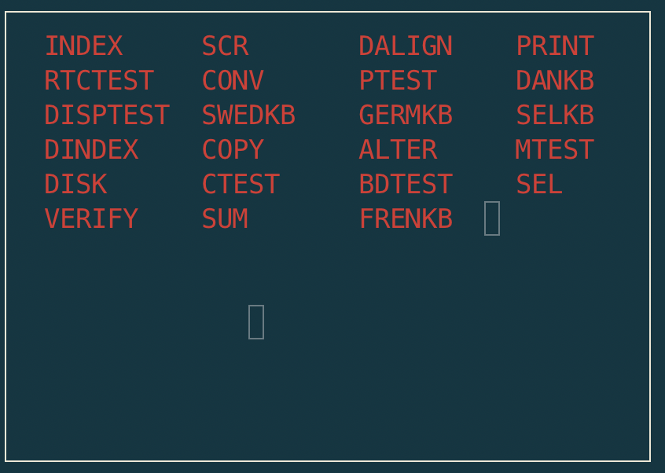

Felsökningsdiskett
^^^^^^^^^^^^^^^^^^

Digitised by Mattis Lind?.

  Contents of **Felsökningsdiskette** as presented by DINDEX

.. code-block:: text

    > cd disks/debugdisk
    > python3 image.py

    Track information for track 0

    INDEX   : recno 0, nrecs 23, record size  40, recs/trk: 130, disk 0, first track  0, last track  0
    SCR     : recno 0, nrecs  1, record size 255, recs/trk:  30, disk 0, first track  1, last track  1
    DALIGN  : recno 0, nrecs  2, record size 255, recs/trk:  30, disk 0, first track  2, last track  2
    PRINT   : recno 0, nrecs  3, record size 255, recs/trk:  30, disk 0, first track  3, last track  3
    RTCTEST : recno 0, nrecs  1, record size 255, recs/trk:  30, disk 0, first track  4, last track  4
    CONV    : recno 0, nrecs  6, record size 255, recs/trk:  30, disk 0, first track  5, last track  5
    PTEST   : recno 0, nrecs  3, record size 255, recs/trk:  30, disk 0, first track  6, last track  7
    DANKB   : recno 0, nrecs  5, record size 255, recs/trk:  30, disk 0, first track  8, last track  8
    DISPTEST: recno 0, nrecs  3, record size 255, recs/trk:  30, disk 0, first track  9, last track  9
    SWEDKB  : recno 0, nrecs  4, record size 255, recs/trk:  30, disk 0, first track 10, last track 10
    GERMKB  : recno 0, nrecs  5, record size 255, recs/trk:  30, disk 0, first track 11, last track 11
    SELKB   : recno 0, nrecs  5, record size 255, recs/trk:  30, disk 0, first track 12, last track 12
    DINDEX  : recno 0, nrecs 22, record size 255, recs/trk:  30, disk 0, first track 13, last track 13
    COPY    : recno 0, nrecs 15, record size 255, recs/trk:  30, disk 0, first track 14, last track 14
    ALTER   : recno 0, nrecs  7, record size 255, recs/trk:  30, disk 0, first track 15, last track 15
    MTEST   : recno 0, nrecs  4, record size 255, recs/trk:  30, disk 0, first track 16, last track 17
    DISK    : recno 0, nrecs 33, record size 255, recs/trk:  30, disk 0, first track 18, last track 19
    CTEST   : recno 0, nrecs 14, record size 255, recs/trk:  30, disk 0, first track 20, last track 20
    BDTEST  : recno 0, nrecs  9, record size 255, recs/trk:  30, disk 0, first track 21, last track 23
    SEL     : recno 0, nrecs  3, record size 255, recs/trk:  30, disk 0, first track 24, last track 24
    VERIFY  : recno 0, nrecs  7, record size 255, recs/trk:  30, disk 0, first track 25, last track 25
    SUM     : recno 0, nrecs  6, record size 255, recs/trk:  30, disk 0, first track 26, last track 26
    FRENKB  : recno 0, nrecs  5, record size 255, recs/trk:  30, disk 0, first track 27, last track 27

However not all tracks are yet reconstructed, only t0 - t16.
