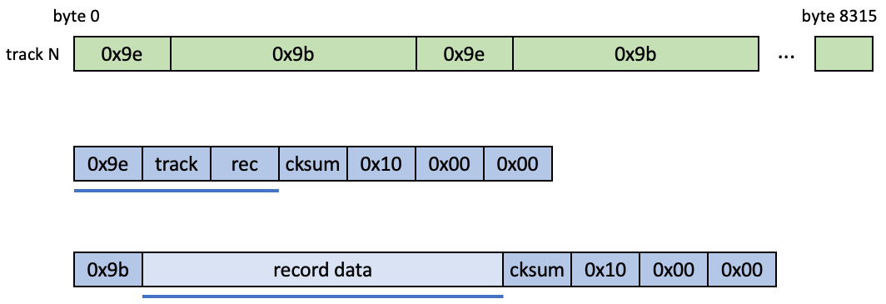
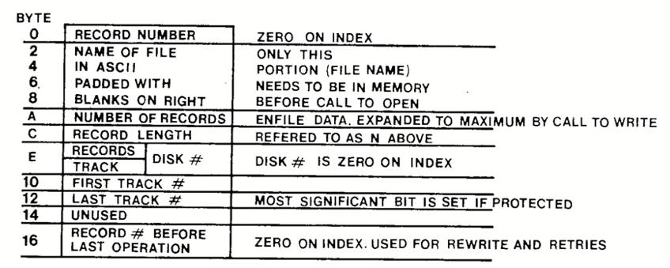
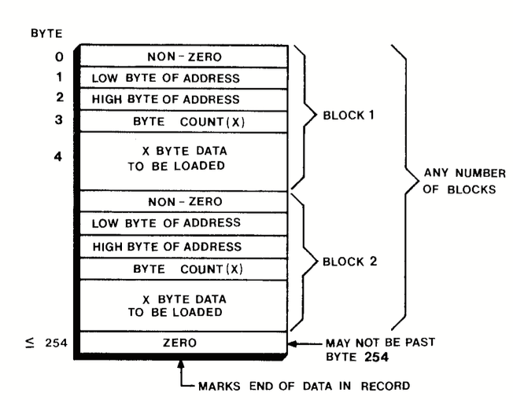

File System
===========

All tracks on the floppy disks have the same format as shown in the figure below.
The track consists of alternating '0x9e' blocks and '0x9b' blocks. These
are alse referred to in the Q1 documentation as **id records** and
**data records**.

  Q1 floppy disk format. Blue lines show which fields are included in the
  checksum.

The ID record is always seven bytes long and consist of 0x9e followed by the
track number, the record number, the checksums, 0x10, 0x00, 0x00.

The data record starts with 0x9b followed by a block of data, followed by
the checksum and 0x10, 0x00, 0x00.

The trailing 0x00's are not used upon reading a record from the disk. However,
write operations write the zeroes.

There are three separate types of data records: INDEX files, program files
and (generic) data files.

All data records on a track have the same size called the record size. The
record size only includes the user data (light blue in the figure). Record sizes
can range from 1 byte (presumably) to 255 bytes.

The lowest record size seen so far is 20 bytes and the highest is 255.

INDEX
^^^^^

The index files reside on track 0 (also names INDEX) and contains information
about the disk layout.

The record size is 40 bytes and its layout is described in Q1 ROS Users Manual
p. 18:

  File description only uses 24 bytes of the 40 available. The rest is typically
  zeroed.

Program files
^^^^^^^^^^^^^

These are executable programs. Record sizes are 255 and multiple tracks
may be used.

A loadable file consists of a consecutive sequence of blocks. The maximum size
for a block is 255. Each block has a one-0byte block separator, a two-byte address
for where the data should be loaded and a one-byte length field. The separator
can have any value, but 0 marks the end of the data in that record.

  Loader record format.

Loading a program will then be a sequence of actions like

.. code-block:: text

    load 40 bytes at 0x9000
    load 20 bytes at 0x9040
    load 100 bytes at 0xa100
    etc.

For an executable program the last block typically loads two bytes into
the address 0x4081. This will be the entry point for the program.

The following is an example retrieved from the SCR program (z80 assembler)
which only occupies a single record of track 1.

.. code-block:: text

  Track 1, Record 0
  separator 0x0d: load 111 bytes into address 0x4300
  4300 f3 3e 00 d3 0a 3e 05 d3 04 16 00 7a d3 03 14 7a  .>...>.....z...z
  4310 fe 80 ca 36 43 2e ff 2d c2 17 43 db 01 fe 00 ca  ...6C..-..C.....
  4320 0b 43 fe 0e ca 0b 43 fe 0f c2 0b 43 db 01 fe 0e  .C....C....C....
  4330 c2 2c 43 c3 0b 43 21 42 43 0e 03 06 2d ed b3 c3  .,C..C!BC...-...
  4340 09 43 20 20 20 20 20 20 20 20 20 20 20 20 20 54  .C             T
  4350 48 49 53 20 53 50 41 43 45 20 46 4f 52 20 52 45  HIS SPACE FOR RE
  4360 4e 54 20 20 20 20 20 20 20 20 20 20 20 20 20     NT

  separator 0x0d: load   2 bytes into address 0x4081
  4081 00 43
