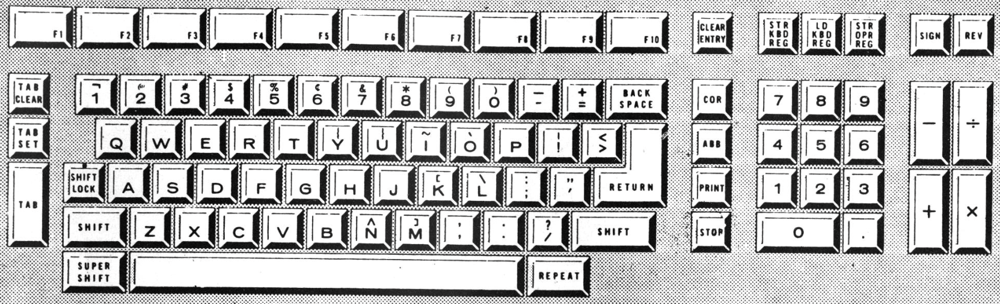
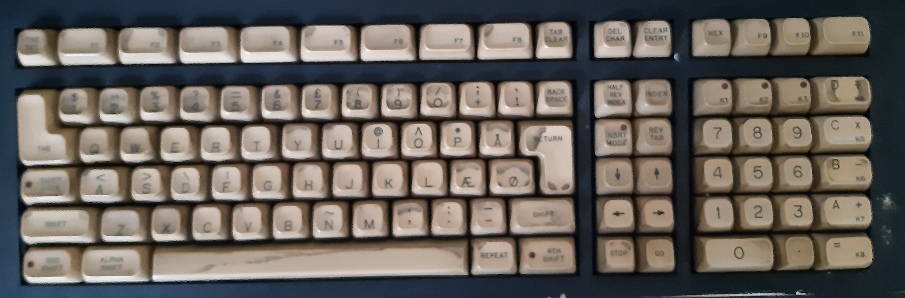

Keyboard
========

Information about keyboard codes can be found in the ROS User's Manual
on page 10 and 11.

This is useful when you want to simulate keyboard input. The documentation is
incomplete as it doesn't mention the important 'GO' key with code 0x0e.

  Keyboard (from 'first system brochure.pdf')

The (JDC branded) Q1 that Datamuseum.dk has in its possession, has a keyboard
with additional function keys not shown in the original brochure: F11, K1 - K8.
Some keys have built-in LEDs to indicate state: Shift Lock, 3RD shift(?),
4TH Shift, INSRT MODE, K1, K2 and K3.

  Keyboard (photo from Datamuseum.dk - better image should be produced)

  According to the manuals (add ref), LEDs for K1 - K3 seem to be directly
  controllable with keyboard IO (bit 4, bit 5 and bit 6) to IO address 0x01, and
  some of the other ones might be controlled by the Keyboard Mode bits
  (bit 2 and bit 3).

  .. list-table:: Keyboard control (speculative)
     :header-rows: 1

     * - Bit
       - Description
     * - 7
       - unknown/unused?
     * - 6
       - Key K3 illumination
     * - 5
       - Key K2 illumination
     * - 4
       - Key K1 illumination
     * - 3
       - Mode (together with bit 2)
     * - 2
       - Mode (together with bit 3)
     * - 1
       - Keyboard beep
     * - 0
       - Keyboard click

Keyboard codes
^^^^^^^^^^^^^^

For keyboard input, the following codes are currently known:

.. list-table:: Key codes
   :header-rows: 1

   * - Key Code
     - Key Name
     - Description
   * - 0x00
     - No key
     - returned from in() when no keypress was detected
   * - 0x01
     -
     - unknown
   * - 0x02
     - TAB CLR
     - Cursor position is not a tab position
   * - 0x03
     - TAB SET
     - Cursor position is a tab position
   * - 0x04
     - CORR
     - Move cursor back one position
   * - 0x05
     -
     - unknown function key (ROS p. 10)
   * - 0x06
     -
     - unknown function key (ROS p. 10)
   * - 0x07
     -
     - unknown function key (ROS p. 10)
   * - 0x08
     -
     - unknown
   * - 0x09
     - TAB
     - Move to next tab
   * - 0x0a
     -
     - unknown
   * - 0x0b
     -
     - unknown
   * - 0x0c
     -
     - unknown function key
   * - 0x0d
     -
     - unknown function key
   * - 0x0e
     - GO (inferred)
     - exit processor wait loop
   * - 0x0f
     - STOP
     - processor loop: wait for GO key
   * - 0x10
     - REV TAB
     - Move to previous tab
   * - 0x11
     - F1
     -
   * - 0x12
     - F2
     -
   * - 0x13
     - F3
     -
   * - 0x14
     - F4
     -
   * - 0x15
     - F5
     -
   * - 0x16
     - F6
     -
   * - 0x17
     - F7
     -
   * - 0x18
     - F8
     -
   * - 0x19
     - F9
     -
   * - 0x1a
     -
     - unknown
   * - 0x1b
     - CLEAR ENTRY
     - Clear all keyboard input
   * - 0x1c
     - CHAR ADV
     - Move cursor right
   * - 0x1d
     - DEL CHAR
     - Delete char under cursor and move text right of cursor
   * - 0x1e
     -
     - unknown
   * - 0x1f
     - INSERT MODE
     - When entering new chars, move text right of cursor
   * - 0x20 - 0x7f
     - ASCII
     - precise range is unknown
   * - 0x83 - 0x97
     -
     - unknown function keys

The function keys were first identified from their use in the DINDEX program. So far
the following have been verified: F1 - F9.
