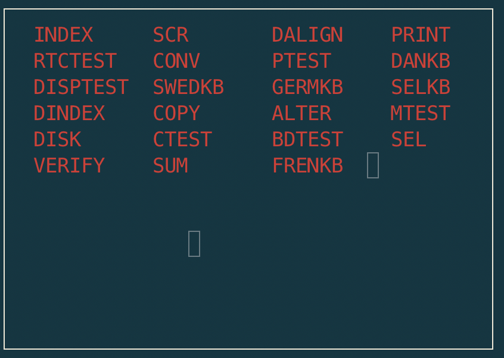

Disk images
===========

At the time of writing only a small set of Q1 floppy disks are known. Some
of these have been attempted digitised using KryoFlux or Catweasel tools.

Most of the digitised images have record and/track errors.

The following lists the images that are currently supported by the Q1 Emulator.

q1 floppy
^^^^^^^^^

Digitised by datamuseum.dk.

.. figure:: ../images/datamuseumdisk.png
  :width: 400
  :align: center

  Contents of **q1 floppy** as presented by DINDEX

The disk contains programs for accounting: FARK, FUDTOG, FMOMS, FRAPP, FBAL,
FREGN, including a chart of accounts 1050.

.. list-table:: Files
   :header-rows: 1

   * - Filename
     - Type
     - Date
     - Function
   * - INDEX
     - directory
     -
     - Housekeeping
   * - BACKUP
     - application
     - V05.12.82
     - Floppy disk backup
   * - DISK (MDISK)
     - application
     - 790827 (v2.8)
     - Disk formatting and allocation
   * - COPY
     - application
     - 821008 (v4.9)
     - Filecopy
   * - COPY
     - application
     - 821008 (v4.9)
     - Filecopy
   * - SORT
     - application
     -
     - (might be corrupted)
   * - JDC
     - application
     - V01.11.82
     - unknown (missing a program disk)

**DINDEX** can provide more details per file, but for a detailed oveview we
can use the command

.. code-block:: text

    > cd disks/datamuseum
    > python3 image.py

    Track information for track 0

    INDEX   : recno 0, nrecs   14, record size  40, recs/trk:  88, disk 0, first track  0, last track  0
    BACKUP  : recno 0, nrecs   14, record size 255, recs/trk:  19, disk 0, first track  1, last track  1
    DISK    : recno 0, nrecs   36, record size 255, recs/trk:  19, disk 0, first track  2, last track  3
    COPY    : recno 0, nrecs   18, record size 255, recs/trk:  19, disk 0, first track  4, last track  4
    SORT    : recno 0, nrecs    7, record size 255, recs/trk:  19, disk 0, first track  5, last track  5
    JDC     : recno 0, nrecs   25, record size 255, recs/trk:  19, disk 0, first track  6, last track  7
    DINDEX  : recno 0, nrecs   23, record size 255, recs/trk:  19, disk 0, first track  8, last track  9
    FARK    : recno 0, nrecs   43, record size 255, recs/trk:  19, disk 0, first track 10, last track 12
    FUDTOG  : recno 0, nrecs   64, record size 255, recs/trk:  19, disk 0, first track 13, last track 16
    FMOMS   : recno 0, nrecs   74, record size 255, recs/trk:  19, disk 0, first track 17, last track 20
    FRAPP   : recno 0, nrecs   59, record size 255, recs/trk:  19, disk 0, first track 21, last track 24
    FBAL    : recno 0, nrecs   79, record size 255, recs/trk:  19, disk 0, first track 25, last track 29
    1050    : recno 0, nrecs 5412, record size  20, recs/trk: 126, disk 0, first track 30, last track 72
    FREGN   : recno 0, nrecs   19, record size 255, recs/trk:  19, disk 0, first track 73, last track 73

Felsökningsdiskett
^^^^^^^^^^^^^^^^^^

Digitised by Mattis Lind?.

  Contents of **Felsökningsdiskette** as presented by DINDEX

.. code-block:: text

    > cd disks/debugdisk
    > python3 image.py

    Track information for track 0

    INDEX   : recno 0, nrecs 23, record size  40, recs/trk: 130, disk 0, first track  0, last track  0
    SCR     : recno 0, nrecs  1, record size 255, recs/trk:  30, disk 0, first track  1, last track  1
    DALIGN  : recno 0, nrecs  2, record size 255, recs/trk:  30, disk 0, first track  2, last track  2
    PRINT   : recno 0, nrecs  3, record size 255, recs/trk:  30, disk 0, first track  3, last track  3
    RTCTEST : recno 0, nrecs  1, record size 255, recs/trk:  30, disk 0, first track  4, last track  4
    CONV    : recno 0, nrecs  6, record size 255, recs/trk:  30, disk 0, first track  5, last track  5
    PTEST   : recno 0, nrecs  3, record size 255, recs/trk:  30, disk 0, first track  6, last track  7
    DANKB   : recno 0, nrecs  5, record size 255, recs/trk:  30, disk 0, first track  8, last track  8
    DISPTEST: recno 0, nrecs  3, record size 255, recs/trk:  30, disk 0, first track  9, last track  9
    SWEDKB  : recno 0, nrecs  4, record size 255, recs/trk:  30, disk 0, first track 10, last track 10
    GERMKB  : recno 0, nrecs  5, record size 255, recs/trk:  30, disk 0, first track 11, last track 11
    SELKB   : recno 0, nrecs  5, record size 255, recs/trk:  30, disk 0, first track 12, last track 12
    DINDEX  : recno 0, nrecs 22, record size 255, recs/trk:  30, disk 0, first track 13, last track 13
    COPY    : recno 0, nrecs 15, record size 255, recs/trk:  30, disk 0, first track 14, last track 14
    ALTER   : recno 0, nrecs  7, record size 255, recs/trk:  30, disk 0, first track 15, last track 15
    MTEST   : recno 0, nrecs  4, record size 255, recs/trk:  30, disk 0, first track 16, last track 17
    DISK    : recno 0, nrecs 33, record size 255, recs/trk:  30, disk 0, first track 18, last track 19
    CTEST   : recno 0, nrecs 14, record size 255, recs/trk:  30, disk 0, first track 20, last track 20
    BDTEST  : recno 0, nrecs  9, record size 255, recs/trk:  30, disk 0, first track 21, last track 23
    SEL     : recno 0, nrecs  3, record size 255, recs/trk:  30, disk 0, first track 24, last track 24
    VERIFY  : recno 0, nrecs  7, record size 255, recs/trk:  30, disk 0, first track 25, last track 25
    SUM     : recno 0, nrecs  6, record size 255, recs/trk:  30, disk 0, first track 26, last track 26
    FRENKB  : recno 0, nrecs  5, record size 255, recs/trk:  30, disk 0, first track 27, last track 27

However not all tracks are yet reconstructed, only t0 - t16.

Fluxsamples
^^^^^^^^^^^

Digitised by Mattis Lind?.

.. code-block:: text

    > cd disks/debugdisk
    > python3 image.py

    INDEX   : recno 0, nrecs  15, record size  40, recs/trk: 130, disk 0, first track  0, last track  0
    V10RGENA: recno 0, nrecs 547, record size  79, recs/trk:  82, disk 0, first track  1, last track  7
    XKOLFORM: recno 0, nrecs   7, record size  47, recs/trk: 122, disk 0, first track  8, last track  8
    YKOLFORM: recno 0, nrecs   2, record size  47, recs/trk: 122, disk 0, first track  9, last track  9
    XRUBFORM: recno 0, nrecs   3, record size  47, recs/trk: 122, disk 0, first track 10, last track 10
    XKTOFIL : recno 0, nrecs  18, record size 100, recs/trk:  67, disk 0, first track 11, last track 11
    YKTOFIL : recno 0, nrecs  33, record size  50, recs/trk: 115, disk 0, first track 12, last track 12
    XXKTOFIL: recno 0, nrecs   9, record size 100, recs/trk:  67, disk 0, first track 13, last track 13
    V10RGOBJ: recno 0, nrecs  31, record size 255, recs/trk:  30, disk 0, first track 14, last track 15
    Q1      : recno 0, nrecs 333, record size  79, recs/trk:  82, disk 0, first track 16, last track 20
    V11     : recno 0, nrecs 147, record size  79, recs/trk:  82, disk 0, first track 21, last track 22
    Q       : recno 0, nrecs  31, record size 255, recs/trk:  30, disk 0, first track 23, last track 24
    V1      : recno 0, nrecs  13, record size 255, recs/trk:  30, disk 0, first track 25, last track 25
    KFIL    : recno 0, nrecs 102, record size  60, recs/trk: 102, disk 0, first track 26, last track 26
    FORM    : recno 0, nrecs  10, record size 255, recs/trk:  30, disk 0, first track 27, last track 27
