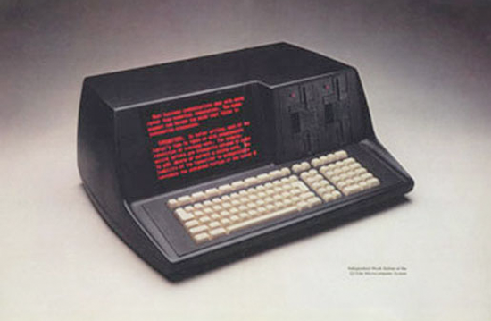

Q1-Lite Emulator
================

Documentation for emulating the
`Q1-Lite personal computer <https://datamuseum.dk/wiki/Q1_Microlite>`_
from ROMs.

  Q1 Microlite, gen. 3

    .. toctree::
        :caption: Background
        :maxdepth: 3
        :hidden:

        information

    .. toctree::
        :caption: System
        :maxdepth: 3
        :hidden:

        roms
        q1io
        q1_io_keyboard
        printer
        disk
        filesys

    .. toctree::
        :caption: PL1
        :maxdepth: 3
        :hidden:

        pl1

    .. toctree::
        :caption: Emulator
        :maxdepth: 3
        :hidden:

        hooks
        emulator
        disassembler
        running
        annotate
        log
        references
