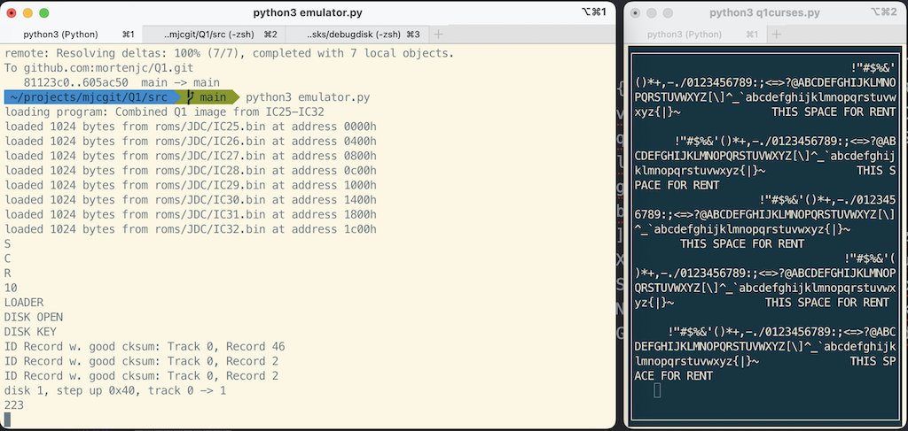
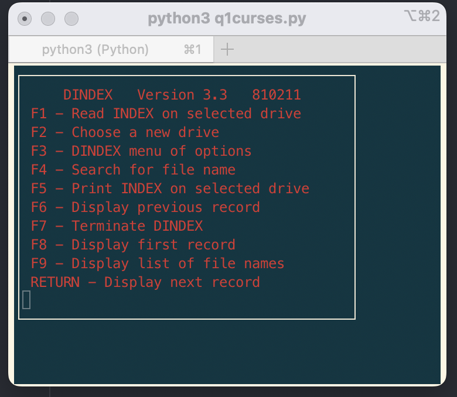
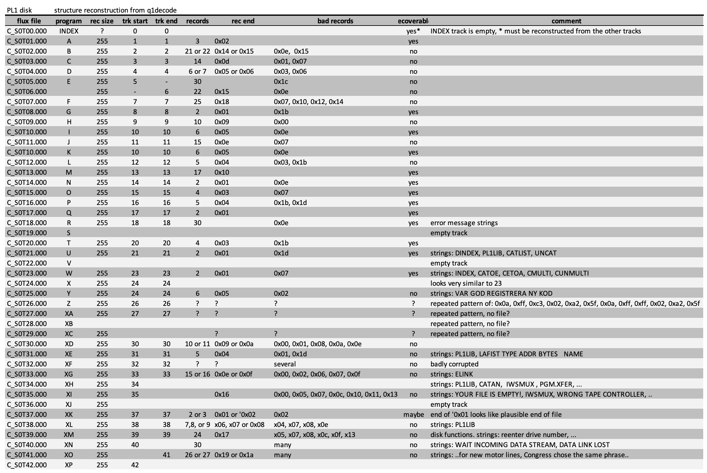

Log book
========
Entries before July 22, 2024 have been reconstructed by git log history.

2024 07 03
----------

Initial commit

2024 07 06
----------

Capture input, boot prompt achieved.

2024 07 09
----------

Work on IO hooks

2024 07 10
----------

IO hooks for all input and output adddresses so far.

2024 07 12
----------

Added a flexible program loader to support rom images and code snippets.

2024 07 13
----------

Added more ROM images from peel.dk

2024 07 18
----------

Keyboard handling by kbhit() and injected keyboard interrupt, several
line edit functions verifed (backspace, clear line, cursor.)

2024 07 19
----------

Fixed major bug in Stack Pointer adjustment during keyboard interrupt.

2024 07 21
----------

file descriptor investigations, annotations, ros module, match module, disk module

2024 07 22
----------

In order to initialise the file system I fill out 55 records on each track
with information compatible with figure 2 on page 17 (same document):

Each record looks like this

.. code-block:: text

    |0x9e|Trk|Sect|Csum|0xa|x00 x00 x00 x00 x00 x00|0x9b|Trk|Sect|Csum|0xa|1234|x00 x00 x00 x00 x00 x00|

So far I have seen no definition of what a sector is. So I am assuming the above
record is two sectors, one starting with 0x9e (ID Record) and one starting with 0x9b
'(Data Record)'.

This clearly need more work, but it is a start.

2024 07 24
----------

The above data format was wrong. The end-of-record value is 0x10, not 0xa. Also the six consecutive
0x00 bytes are not actually returned by the controller.

Despite the picture on page 17, it seems that when reading a file desctiptor in a
data record (0x9b), the checksum comes AFTER the FD and User data:

.. code-block:: text

  |0x9b| FD data (24 bytes) | User data | Csum | 0x10

Also, possibly due to other errors it looks like two sets of 0x9e blocks should come
before the 0x9b:

[0x9e ...] [0x9e ...] [0x9b ...]

Also, there does not seem to be a 0x10 after the ID records.

The filesystem can be initialised by adding ID and data blocks or even
manyally writing to certain locations:

.. code-block:: text

    disk.idrecord(  2189, 17, 0)
    disk.idrecord(  2193, 0, 0)
    disk.datarecord(2197, 0, 25, 'MJC     ', data)
    disk.idrecord(  2240, 0, 0)
    disk.datarecord(2244, 0, 26, 'MJC     ', data)
    disk.idrecord(  2287, 0, 0)
    disk.idrecord(  2291, 0, 0)
    disk.datarecord(2295, 0, 26, 'MJC     ', data)
    for i in range(100):
        disk.data[0][2350+i] = 0x9e

After messing with the file system as above (should probably implement a loader
soon), At least I get the OS to acknowledge that the disk I made was bad:

.. code-block:: text

  DISK OPEN
  DISK KEY
  DISK READ
  disk 1, step 0, track 0
  disk 1, step 0, track 1
  ...
  disk 1, step 0, track 28
  disk 1, step 0, track 29
  disk 1, step 0, track 30
  DISK (error) REPORT

  FORMAT ERR
   ON
  MJC

Only the string 'FORMAT ERR ...' is output by the Q1 Emulator. The rest is debugging
output based on IO calls and program counter values.

It would obviously help with more detailed knowledge about disk and file structures.

20.45

Disassembly from the emuklation (and bad disk format) reveals that this system
is expecting 35 tracks per disk, not 77 as previously assumed.

2024 07 27
----------

Still messing around with the filesystem and disk controller. Close but no cigar. Instead
try and work on something else.

Managed to locate the entry point for the pseudo machine code interpreter. This
is what PL/1 programs are compiled into.

Created a simple program to add two numbers on the stack. It consists of two
opcodes '0xa' for add and '0x1f' for return (Q1 Advanced PL/1 programmer's
Manual p. 3 and 4):

.. code-block:: python

  # PL/1 Interpretive Program Counter
  ["snippet", [0x00, 0x80],        0x40fe], # set IPC = x8000

  # Setup two numbers to be added, run PL/1 program
  ["snippet", [0x00],              0x6000], # nop (for trace)
  ["snippet", [0x21, 0x80, 0x40],  0x6001], # hl = 4080
  ["snippet", [0xf9],              0x6004], # SP = 4080
  ["snippet", [0x21, 0x10, 0x00],  0x6005], # hl = 0010
  ["snippet", [0xe5],              0x6008], # push hl
  ["snippet", [0x21, 0x20, 0x00],  0x6009], # hl = 0020
  ["snippet", [0xe5],              0x600c], # push hl
  ["snippet", [0xc3, 0x7c, 0x18],  0x600d], # run PL/1 program

  # PL/1 program
  ["snippet", [0x0a],              0x8000], # add two numbers
  ["snippet", [0x1f],              0x8001]  # return

The funtionality was verified by trace from the emulation:

.. code-block:: text

  6001 21 80 40     ; ld hl, 0x4080             | sp=0000, a=00    bc=0000, de=0000, hl=0000, ix=0000, iy=0000
  6004 f9           ; ld sp, hl                 | sp=0000, a=00    bc=0000, de=0000, hl=4080, ix=0000, iy=0000
  6005 21 10 00     ; ld hl, 0x10               | sp=4080, a=00    bc=0000, de=0000, hl=4080, ix=0000, iy=0000
  6008 e5           ; push hl                   | sp=4080, a=00    bc=0000, de=0000, hl=0010, ix=0000, iy=0000
  6009 21 20 00     ; ld hl, 0x20               | sp=407e, a=00    bc=0000, de=0000, hl=0010, ix=0000, iy=0000
  600c e5           ; push hl                   | sp=407e, a=00    bc=0000, de=0000, hl=0020, ix=0000, iy=0000
  600d c3 7c 18     ; jp 0x187c                 | sp=407c, a=00    bc=0000, de=0000, hl=0020, ix=0000, iy=0000
  187c 2a fe 40     ; ld hl, (0x40fe)           | sp=407c, a=00    bc=0000, de=0000, hl=0020, ix=0000, iy=0000
  187f 7e           ; ld a, (hl)                | sp=407c, a=00    bc=0000, de=0000, hl=8000, ix=0000, iy=0000
  1880 23           ; inc hl                    | sp=407c, a=0a    bc=0000, de=0000, hl=8000, ix=0000, iy=0000
  1881 87           ; add a, a                  | sp=407c, a=0a    bc=0000, de=0000, hl=8001, ix=0000, iy=0000
  1882 fa 95 18     ; jp m, 0x1895              | sp=407c, a=14    bc=0000, de=0000, hl=8001, ix=0000, iy=0000
  1885 da 95 18     ; jp c, 0x1895              | sp=407c, a=14    bc=0000, de=0000, hl=8001, ix=0000, iy=0000
  1888 22 fe 40     ; ld (0x40fe), hl           | sp=407c, a=14    bc=0000, de=0000, hl=8001, ix=0000, iy=0000
  188b c6 0c        ; add a, 0xc                | sp=407c, a=14    bc=0000, de=0000, hl=8001, ix=0000, iy=0000
  188d 6f           ; ld l, a                   | sp=407c, a=20' ' bc=0000, de=0000, hl=8001, ix=0000, iy=0000
  188e 26 18        ; ld h, 0x18                | sp=407c, a=20' ' bc=0000, de=0000, hl=8020, ix=0000, iy=0000
  1890 7e           ; ld a, (hl)                | sp=407c, a=20' ' bc=0000, de=0000, hl=1820, ix=0000, iy=0000
  1891 23           ; inc hl                    | sp=407c, a=a5    bc=0000, de=0000, hl=1820, ix=0000, iy=0000
  1892 66           ; ld h, (hl)                | sp=407c, a=a5    bc=0000, de=0000, hl=1821, ix=0000, iy=0000
  1893 6f           ; ld l, a                   | sp=407c, a=a5    bc=0000, de=0000, hl=1821, ix=0000, iy=0000
  1894 e9           ; jp (hl)                   | sp=407c, a=a5    bc=0000, de=0000, hl=18a5, ix=0000, iy=0000
  18a5 e1           ; pop hl                    | sp=407c, a=a5    bc=0000, de=0000, hl=18a5, ix=0000, iy=0000
  18a6 d1           ; pop de                    | sp=407e, a=a5    bc=0000, de=0000, hl=0020, ix=0000, iy=0000
  18a7 19           ; add hl, de                | sp=4080, a=a5    bc=0000, de=0010, hl=0020, ix=0000, iy=0000
  18a8 e5           ; push hl                   | sp=4080, a=a5    bc=0000, de=0010, hl=0030, ix=0000, iy=0000
  18a9 c3 7c 18     ; jp 0x187c                 | sp=407e, a=a5    bc=0000, de=0010, hl=0030, ix=0000, iy=0000
  187c 2a fe 40     ; ld hl, (0x40fe)           | sp=407e, a=a5    bc=0000, de=0010, hl=0030, ix=0000, iy=0000
  187f 7e           ; ld a, (hl)                | sp=407e, a=a5    bc=0000, de=0010, hl=8001, ix=0000, iy=0000
  1880 23           ; inc hl                    | sp=407e, a=1f    bc=0000, de=0010, hl=8001, ix=0000, iy=0000
  1881 87           ; add a, a                  | sp=407e, a=1f    bc=0000, de=0010, hl=8002, ix=0000, iy=0000
  1882 fa 95 18     ; jp m, 0x1895              | sp=407e, a=3e'>' bc=0000, de=0010, hl=8002, ix=0000, iy=0000
  1885 da 95 18     ; jp c, 0x1895              | sp=407e, a=3e'>' bc=0000, de=0010, hl=8002, ix=0000, iy=0000
  1888 22 fe 40     ; ld (0x40fe), hl           | sp=407e, a=3e'>' bc=0000, de=0010, hl=8002, ix=0000, iy=0000
  188b c6 0c        ; add a, 0xc                | sp=407e, a=3e'>' bc=0000, de=0010, hl=8002, ix=0000, iy=0000
  188d 6f           ; ld l, a                   | sp=407e, a=4a'J' bc=0000, de=0010, hl=8002, ix=0000, iy=0000
  188e 26 18        ; ld h, 0x18                | sp=407e, a=4a'J' bc=0000, de=0010, hl=804a, ix=0000, iy=0000
  1890 7e           ; ld a, (hl)                | sp=407e, a=4a'J' bc=0000, de=0010, hl=184a, ix=0000, iy=0000
  1891 23           ; inc hl                    | sp=407e, a=38'8' bc=0000, de=0010, hl=184a, ix=0000, iy=0000
  1892 66           ; ld h, (hl)                | sp=407e, a=38'8' bc=0000, de=0010, hl=184b, ix=0000, iy=0000
  1893 6f           ; ld l, a                   | sp=407e, a=38'8' bc=0000, de=0010, hl=194b, ix=0000, iy=0000
  1894 e9           ; jp (hl)                   | sp=407e, a=38'8' bc=0000, de=0010, hl=1938, ix=0000, iy=0000
  1938 c9           ; ret                       | sp=407e, a=38'8' bc=0000, de=0010, hl=1938, ix=0000, iy=0000

First we put two numbers 0x0010 and 0x0020 on the stack, then call the pseudocode
interpreter (pc 0x6001 - 0x600f). The 'add' pseudocode instruction is picked up at 0x187f, causing
the add istructions at 0x18a5 - 0x 18a7, placing the correct result (0x0030) on the stack
at 0x18a8.

Then at 0x1875 the 'return from subroutine'  pseudocode instruction is retrieved,
causing the return instruction at 0x1938.

2024 07 28
----------

Testing more pseudocode instructions: multiply, divide and binary to string.

.. code-block:: python

  psmcb2ch = {
      "descr": "Q1 pseudo machine code program (bin to char)",
      "start": 0x6000,
      "stop" : 0x1938,
      "data": [
              ["file", "roms/JDC/full.bin", 0x0000],
              # PL/1 Interpretive Program Counter
              ["snippet", [0x00, 0x80],        0x40fe], # set IPC = x8000
              # Setup two numbers to be added, run PL/1 program
              ["snippet", [0x00],              0x6000], # nop (for trace)
              ["snippet", [0x21, 0x80, 0x40],  0x6001], # hl = 0x4080
              ["snippet", [0xf9],              0x6004], # SP = 0x4080
              ["snippet", [0x21, 0xab, 0xcd],  0x6005], # hl = 0xabcd, unused
              ["snippet", [0xe5],              0x6008], # push hl
              ["snippet", [0x21, 0xff, 0x7f],  0x6009], # hl = 0x7fff
              ["snippet", [0xe5],              0x600c], # push hl
              ["snippet", [0xc3, 0x7c, 0x18],  0x600d], # run program
              # 'PL/1' program
              ["snippet", [0x19],              0x8000], # divide
              ["snippet", [0x1f],              0x8001]  # return
      ],
      "funcs" : [],
      "pois" : []
  }

Here 0x7fff is converted into ascii 32767 as verified from the hexdump:

.. code-block:: text

  ########### HEXDUMP 0x2000 - 0x10000 ####################################
  ....
  4070 03 00 44 00 9b 06 04 00 2e 42 05 00 2e 42 ab cd  ..D......B...B..
  ....
  40f0 fd fd fd fd fd fd fd fd fd fd fd fd fd fd 02 80  ................
  ....
  4220 fd fd fd fd fd fd fd fd fd fd fd fd fd fd 33 32  ..............32
  4230 37 36 37 fd fd fd fd fd fd fd fd fd fd fd fd fd  767.............
  ....
  6000 00 21 80 40 f9 21 ab cd e5 21 ff 7f e5 c3 7c 18  .!.@.!...!......
  ....
  8000 19 1f fd fd fd fd fd fd fd fd fd fd fd fd fd fd  ................
  ....
  ########### HEXDUMP END #################################################

2024 07 30
----------

Mostly address and address range annotations. Some **pylint** related
changes.

2024 08 02
----------

Found real Q1 disk images (from flux samples) here:
https://github.com/MattisLind/q1decode/blob/main/Q1DISKS/README.md

This clarified the sector numbering. converted testdiskette C_S0T00.000 into
a python structure which is loaded when creating the filesystem. There are 23
file on the disk, including the special INDEX file.

.. code-block:: text

  > python3 emulator.py
  INDEX:  INDEX
  INDEX:  SCR
  INDEX:  DALIGN
  INDEX:  PRINT
  INDEX:  RTCTEST
  INDEX:  CONV
  INDEX:  PTEST
  INDEX:  DANKB
  INDEX:  DISPTEST
  INDEX:  SWEDKB
  INDEX:  GERMKB
  INDEX:  SELKB
  INDEX:  DINDEX
  INDEX:  COPY
  INDEX:  ALTER
  INDEX:  MTEST
  INDEX:  DISK
  INDEX:  CTEST
  INDEX:  BDTEST
  INDEX:  SEL
  INDEX:  VERIFY
  INDEX:  SUM
  INDEX:  FRENKB

There are still some issues with accessing the files. For example if I type in
'SCR' the emulator enters an infinite loop searching for iD records on Track 0.

On track 0 all data records have size 40 bytes.

(0x9e, track, sector, cksum, 0x10, 0x9b, 40 bytes, cksum, 0x10)

On the other tracks records are 255 bytes:

(0x9e, track, sector, cksum, 0x10, 0x9b, 255 bytes, cksum, 0x10)

2024 08 04
----------

Still a bit confused about the size of the disk. I've seen code
for skipping 2189 bytes (reading them but not examining them) before
looking for markers. So far I had assumed that something else was
on the disk. Now I am not so sure. Perhaps this allows the disk to
spin up before addressing the data?

Added several disk **images** and a utility to load data recovered from the
fluxsamples provided by Mattis Lind.

For example.

.. code-block:: text

  src/disks/fluxsamples> python3 image.py
  ...
  nonz 0x52: load  78 bytes into address 0x4547
  41 2e 20 20 20 20 20 20 20 20 20 20 20 20 20 20  A.
  20 20 20 20 20 20 20 20 20 20 20 20 20 20 20 20
  20 20 20 20 20 20 20 cb 10 9e 01 02 03 10 9b 20         ........
  20 20 20 20 20 20 20 44 41 54 45 2d 57 52 49 54         DATE-WRIT
  54 45 4e 2e 20 20 20 20 20 20 20 20 20 20        TEN.

  nonz 0x20: load  57 bytes into address 0x3120
  38 34 2d 30 32 2d 30 36 2e 20 20 20 20 20 20 20  84-02-06.
  20 20 20 20 20 20 20 20 20 20 20 20 20 20 20 20
  20 20 20 20 20 20 20 20 20 20 20 20 ac 10 9e 01              ....
  03 04 10 9b 20 20 20 20 20                       ....

  nonz 0x20: load  65 bytes into address 0x2020
  55 54 48 4f 52 2e 20 20 20 20 20 20 20 20 20 20  UTHOR.
  20 20 20 20 20 20 20 20 4f 4c 4c 45 2e 20 20 20          OLLE.
  20 20 20 20 20 20 20 20 20 20 20 20 20 20 20 20
  20 20 20 20 20 20 20 20 20 20 20 20 20 20 20 20
  ...

2024 08 17
----------

Oops, forgot to update the log for a while. But yesterday I succeeded in
loading and running the 'SCR' program from (emulated) disk.

  This marks a major milestone in this project. The sequence of commands that
  verifies this are

.. code-block:: text

  > python3 emulator.py
  > SCR <enter>
  > opt-b
  ########### HEXDUMP 0x2000 - 0x10000 ####################################
  ....
  4060 fd fd fd fd fd fd fd fd fd fd 47 04 56 05 78 07  ..........G.V.x.
  4070 19 13 00 00 04 14 4b 14 d0 40 44 0d 01 02 82 02  ......K..@D.....
  4080 c3 00 43 c3 fd 07 c3 15 08 00 00 00 00 00 02 00  ..C.............
  4090 00 0d 00 00 20 00 00 00 00 00 42 01 00 20 02 00  .... .....B.. ..
  40a0 01 01 01 40 00 00 00 00 82 00 28 00 82 01 00 00  ...@......(.....
  40b0 00 00 00 00 01 00 ff 00 00 00 00 00 00 00 00 00  ................
  40c0 00 00 00 00 00 00 00 00 00 00 00 00 00 00 00 00  ................
  40d0 01 00 53 43 52 20 20 20 20 20 01 00 ff 00 1e 01  ..SCR     ......
  40e0 01 00 01 00 00 00 00 00 00 00 00 00 00 00 00 00  ................
  40f0 00 00 00 00 00 00 00 00 00 00 00 00 00 00 00 00  ................
  4100 00 20 20 20 20 20 20 20 20 20 20 20 20 20 20 20  .
  4110 20 20 20 20 20 20 20 20 20 20 20 20 20 20 20 20
  4120 20 20 20 20 20 20 20 20 20 20 20 20 20 20 20 20
  4130 20 20 20 20 20 20 20 20 20 20 20 20 20 20 20 20
  4140 20 20 20 20 20 20 20 20 20 20 20 20 20 20 20 20
  4150 20 20 20 20 20 20 20 20 20 20 20 20 20 20 20 20
  4160 20 20 20 20 20 20 20 20 20 20 20 20 20 20 20 20
  4170 20 20 20 20 20 20 20 20 20 20 20 20 20 20 20 20
  ....
  4200 0d 00 43 6f f3 3e 00 d3 0a 3e 05 d3 04 16 00 7a  ..Co.>...>......
  4210 d3 03 14 7a fe 80 ca 36 43 2e ff 2d c2 17 43 db  .......6C..-..C.
  4220 01 fe 00 ca 0b 43 fe 0e ca 0b 43 fe 0f c2 0b 43  .....C....C....C
  4230 db 01 fe 0e c2 2c 43 c3 0b 43 21 42 43 0e 03 06  .....,C..C!BC...
  4240 2d ed b3 c3 09 43 20 20 20 20 20 20 20 20 20 20  -....C
  4250 20 20 20 54 48 49 53 20 53 50 41 43 45 20 46 4f     THIS SPACE FO
  4260 52 20 52 45 4e 54 20 20 20 20 20 20 20 20 20 20  R RENT
  4270 20 20 20 0d 81 40 02 00 43 00 20 20 20 20 20 11     ..@..C.     .
  4280 00 21 00 43 0e 01 cd 1e 00 3a 00 43 fe 2c c2 d3  .!.C.....:.C.,..
  4290 43 32 80 43 32 81 43 21 00 43 0e 01 cd 1e 00 cd  C2.C2.C!.C......
  42a0 1b 00 21 d0 40 cd 0c 08 c4 18 08 21 00 00 22 da  ..!.@......!..".
  42b0 40 c3 e7 43 0d 59 4f 55 52 20 46 49 4c 45 20 49  @..C.YOUR FILE I
  42c0 53 20 45 4d 50 54 59 21 b5 43 0e 13 cd 27 00 c3  S EMPTY!.C...'..
  42d0 d0 43 cd 1b 00 21 d0 40 cd 0c 08 c4 18 08 2a da  .C...!.@......*.
  42e0 40 7c b5 ca c8 43 cd 24 00 21 d0 40 0e 16 11 c0  @....C.$.!.@....
  42f0 42 cd 00 78 75 45 3c 39 36 2f 2a 25 1e 18 02 00  B..xuE<96/*%....
  4300 f3 3e 00 d3 0a 3e 05 d3 04 16 00 7a d3 03 14 7a  .>...>..........
  4310 fe 80 ca 36 43 2e ff 2d c2 17 43 db 01 fe 00 ca  ...6C..-..C.....
  4320 0b 43 fe 0e ca 0b 43 fe 0f c2 0b 43 db 01 fe 0e  .C....C....C....
  4330 c2 2c 43 c3 0b 43 21 42 43 0e 03 06 2d ed b3 c3  .,C..C!BC...-...
  4340 09 43 20 20 20 20 20 20 20 20 20 20 20 20 20 54  .C             T
  4350 48 49 53 20 53 50 41 43 45 20 46 4f 52 20 52 45  HIS SPACE FOR RE
  4360 4e 54 20 20 20 20 20 20 20 20 20 20 20 20 20 fd  NT             .
  ....
  ########### HEXDUMP END #################################################
  > <enter>
  VWXYZ[\]^_`abcdefghijklmnopqrstuvwxyz{|}             THIS SPACE FOR RENT              !"#$%&'()*+,-./0123456789:;<=>?@ABCDEFGHIJKLMNOP
  QRSTUVWXYZ[\]^_`abcdefghijklmnopqrstuvwxyz{|}             THIS SPACE FOR RENT              !"#$%&'()*+,-./0123456789:;<=>?@ABCDEFGHIJK
  LMNOPQRSTUVWXYZ[\]^_`abcdefghijklmnopqrstuvwxyz{|}             THIS SPACE FOR RENT              !"#$%&'()*+,-./0123456789:;<=>?@ABCDEF
  GHIJKLMNOPQRSTUVWXYZ[\]^_`abcdefghijklmnopqrstuvwxyz{|}             THIS SPACE FOR RENT              !"#$%&'()*+,-./0123456789:;<=>?@A
  BCDEFGHIJKLMNOPQRSTUVWXYZ[\]^_`abcdefghijklmnopqrstuvwxyz{|}             THIS SPACE FOR RENT              !"#$%&'()*+,-./0123456789:;<
  =>?@ABCDEFGHIJKLMNOPQRSTUVWXYZ[\]^_`abcdefghijklmnopqrstuvwxyz{|}             THIS SPACE FOR RENT              !"#$%&'()*+,-./01234567
  89:;<=>?@ABCDEFGHIJKLMNOPQRSTUVWXYZ[\]^_`abcdefghijklmnopqrstuvwxyz{|}             THIS SPACE FOR RENT              !"#$%&'()*+,-./012
  3456789:;<=>?@ABCDEFGHIJKLMNOPQRSTUVWXYZ[\]^_`abcdefghijklmnopqrstuvwxyz{|}             THIS SPACE FOR RENT              !"#$%&'()*+,-
  ./0123456789:;<=>?@ABCDEFGHIJKLMNOPQRSTUVWXYZ[\]^_`abcdefghijklmnopqrstuvwxyz{|}             THIS SPACE FOR RENT              !"#$%&'(
  )*+,-./0123456789:;<=>?@ABCDEFGHIJKLMNOPQRSTUVWXYZ[\]^_`abcdefghijklmnopqrstuvwxyz{|}             THIS SPACE FOR RENT              !"#
  $%&'()*+,-./0123456789:;<=>?@ABCDEFGHIJKLMNOPQRSTUVWXYZ[\]^_`abcdefghijklmnopqrstuvwxyz{|}             THIS SPACE FOR RENT
    !"#$%&'()*+,-./0123456789:;<=>?@ABCDEFGHIJKLMNOPQRSTUVWXYZ[\]^_`abcdefghijklmnopqrstuvwxyz{|}             THIS SPACE FOR RENT
           !"#$%&'()*+,-./0123456789:;<=>?@ABCDEFGHIJKLMNOPQRSTUVWXYZ[\]^_`abcdefghijklmnopqrstuvwxyz{|}             THIS SPACE FOR RENT

2024 08 18
----------

Better display emulation. Had to resort to using UDP to send the
display buffer to a **curses** based application.

  Left window: debug output and keyboard input. Right window display emulator.

2024 08 28
----------

Some cleanup, added track 4 from the 'felsökningsdiskett' disk. Added the PRINT
program from the same disk for disassembly and debug. It is the first use of the
real time clock (RTC) that I have seen. Yet another item for the (nonexisting)
TODO list.

2024 08 29
----------

Added RTC in() and out() abstractions, corrected program name from PRINT to
RTCTEST. Added a beep for keyboard out() (bits 0 and 1).

2024 08 30
----------

Added a readbin.py function that converts the datamuseum .BIN file into python
code that can be loaded by the emulator.

2024 08 31
----------

Managed to create a filesytem with (parts of) the data from Q1_FLOPPY.BIN. The
main objective was to run the DINDEX program which was corrupted on the
debugdisk (felsökningsdiskett) from Mattis.

  DINDEX program running.

2024 10 09
----------

Finally got around to investigate the use of the Fn function keys. These
are used as function selectors in the DINDEX program. The ROS user's manual
mentions some reserved ranges (under PROCH on page 10) but the text was a
bit unclear to me and it certainly was not obvious where F1 started. But a
bit of exprimentation finally revealed that F1 == 0x11. The rest was quickly
verified after that. So far only F5 seems to cause me problems, probably
due to missing emulator functionality, but the
rest of the range F1 - F9 has been verified.

I also figured out a way to 'debug' the PL/1 programs. Basically I can add
the PC address for each function to a disctionary and use that to print out
some text to provide an indication of the program flow.

2024 10 10
----------

8:00

Better documentation for keyboard input. Verified that F5 key as used in DINDEX
causes system halt due to unregistered output hook to address 0xc. This could
be a printer as the menu says "F5 - Print INDEX on selected drive", but this
is currently speculation.

Update 9:53

F5 definitely seems to trigger printing via out() to the undocumented device
0xc. By collecting the output in a buffer and printing it out when receiving
a linefeed (0xa) the following neatly formatted output is produced:

.. code-block:: text

                             Maximum  First  Last          Records/
  Name     Records   Length  Records  Track  Track  Tracks  Track

  INDEX       14       40       88      0      0      1      88
  BACKUP      14      255       19      1      1      1      19
  DISK        36      255       38      2      3      2      19
  COPY        18      255       19      4      4      1      19
  SORT         7      255       19      5      5      1      19
  JDC         25      255       38      6      7      2      19
  DINDEX      23      255       38      8      9      2      19
  FARK        43      255       57     10     12      3      19
  FUDTOG      64      255       76     13     16      4      19
  FMOMS       74      255       76     17     20      4      19
  FRAPP       59      255       76     21     24      4      19
  FBAL        79      255       95     25     29      5      19

However, not all files are printed. For example a multi-track file named 1050
is not included. Not sure why.

2024 11 08
----------

PL/1 disk investigations

Using **q1decode** from Mattis Lind, I try to reconstruct the contents of the disk
based on individual track information. Track 0 has no information an thus we
have no filenames to help us. Many files/tracks seem to have unrecoverable
errors.

  PL/1 disk track information (inferred)

2024 11 10
----------

Contacted Achim Baqué (https://www.achimbaque.com/#about) who is the new owner
of the Q1 previously held by Mattis Lind.

2024 11 11
----------

Added new tracks (not working yet) from Felsökningsdiskett. Restructured the
emulator by creating the Emulator class.

Contacted HomeComputerMuseum (https://www.homecomputermuseum.nl/) as they seem
to have a Q1 or two on loan (possibly from Achim).

2024 11 12
----------

Added more tracks (working, but many are corrupted) from Felsökningsdiskett.
Improved Serial Impact Printer and Dot Matrix Printer IO.

Got a reply from HomeComputerMuseum. They have no disks. Asked if they would
introduce me to Bernardo (TheByteAttic) as he is otherwise difficult to get
in touch with.

2024 11 13
----------

Added SerialImpactPrinter class to simplify **z8io.py** which was getting messy.
Better print buffering.
