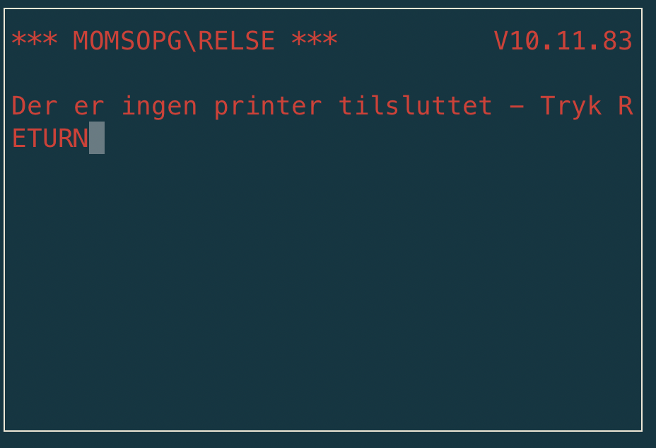

Printers
========

At least two printer types are supported: Serial Impact Printer
with IO addresses 5, 6, 7 and Dot Matrix Printer with IO address 8.

Printer status
^^^^^^^^^^^^^^

For the printer to be used by the ROS, it apparently has to be 'selected'. I am
not sure how it is selected practially, but the status of a selected
printer is bit 0. The 'Q1 ASM IO address' manual only states this
explicitly for the Dot Matrix Printer but it seems to be valid for the
Serial Impact Printer too.

I originally thought that status 0x00 meant printer is ready, no errors. So the
emulator returned this value for both printers.

But running the program **FMOMS** I got the following error message:

  Output from FMOMS program

which lead me to further progress on the printer interface.
